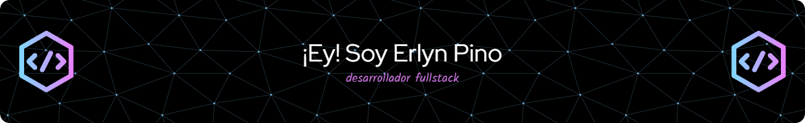

Hi My name is Erlyn Pino
==================================================================================================================================

* 🌍  I'm based in Bogotá - Colombia
* 🖥️  See my portfolio at [https://erlynpino.com/](http://erlynpino.com/)
* ✉️  You can contact me at [erlynpino@gmail.com](mailto:erlynpino@gmail.com)
* 🧠  I'm learning Currently, I'm expanding my knowledge in back-end technologies like Node.js. Continuous learning is crucial to me, and I'm always excited to take on new challenges and stay at the forefront of the latest technologies.

* 🤝  I'm open to collaborating on -💞 I'm interested in collaborating on projects that inspire creativity and push the boundaries of technology. Whether it's a web application, a mobile app, or a complex system architecture, I enjoy working in collaborative environments where innovation and teamwork are key.
* ⚡  -📫 You can find me and learn more about my work at erlynpino.com. I'm always open to connections and collaborations. Feel free to visit my website to get in touch and start a conversation about code, collaboration, or any topic related to technology! You can also explore my projects and contributions here on GitHub. Looking forward to connecting with you soon!

### Skills

<table><tr><td valign="top" width="50%">

### Frontend  

  
  
  
  
  
  
  
  
  
  
  
  
  
  
  
  
  
  
  
  
  

</td><td valign="top" width="50%">

### Backend  

  
  
  
  
  
  
  
  
  
  
  
  
  
  
  
  
  

</td></tr></table> 

### Socials

### Github Stats

<table><tr><td valign="top" width="50%">
<b>My GitHub Stats</b>

</td><td valign="top" width="50%">
<b>Top Lenguajes</b>

</td></tr></table> 

